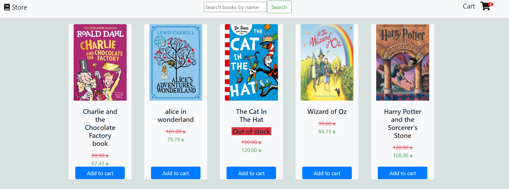
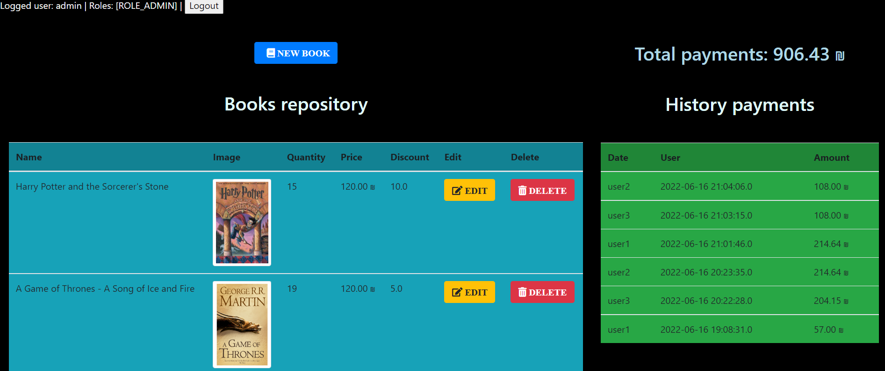

<h1>Book Store-Spring</h1>

A book store web application.
In the store the user able to browse different books, add them to shopping cart and buy them.
In addition is the admin panel, were the admin can manipulate the book repository and view the payments history.

running on port 8080. 

<h3><u>Screenshots</u></h3>
<h5>store</h5>

<h5>admin</h5>

<h3><u>Compilation</u></h3>

Use the IntelliJ configuration to build the project.

<h3><u>Configurations</u></h3> 

No special configuration needed.

<h3><u>Documentation</u></h3>

in doc directory

<h3><u>Execute</u></h3>
<ul>
  <li>
  Use the "db.sql" we provide in the DB folder Or 
  Prepare an sql database named "db.sql".
  </li>
  <li>
    Execute the program from the intellij. .
  </li>
    <li>
   the port the site is 8080 and The port of the database is 3306, you change if you wish to use other ports
    </li>
</ul>

<h3><u>Databases</u></h3>
<ol>
  <li>
    Books
  </li>
  <li>
    Payments
  </li>
</ol>

	 

